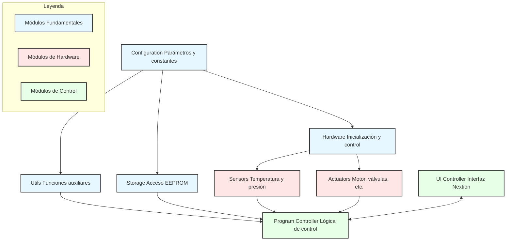

```mermaid
graph TD
    %% Título y configuración
    classDef coreModules fill:#e6f7ff,stroke:#333,stroke-width:2
    classDef hardwareModules fill:#ffe6e6,stroke:#333,stroke-width:2
    classDef controlModules fill:#e6ffe6,stroke:#333,stroke-width:2
    
    %% Módulos Core
    Config[Configuration Parámetros y constantes]
    Hardware[Hardware Inicialización y control]
    Utils[Utils Funciones auxiliares]
    Storage[Storage Acceso EEPROM]
    
    %% Módulos de Hardware
    Sensors[Sensors Temperatura y presión]
    Actuators[Actuators Motor, válvulas, etc.]
    
    %% Módulos de Control
    UIController[UI Controller Interfaz Nextion]
    ProgramController[Program Controller Lógica de control]
    
    %% Relaciones entre módulos
    Config --> Hardware
    Config --> Storage
    Config --> Utils
    
    Hardware --> Sensors
    Hardware --> Actuators
    
    Utils --> ProgramController
    Storage --> ProgramController
    
    Sensors --> ProgramController
    Actuators --> ProgramController
    
    UIController <--> ProgramController
    
    %% Asignación de clases
    class Config,Hardware,Utils,Storage coreModules
    class Sensors,Actuators hardwareModules
    class UIController,ProgramController controlModules
    
    %% Leyenda
    subgraph Leyenda
        CoreModule[Módulos Fundamentales]
        HardwareModule[Módulos de Hardware]
        ControlModule[Módulos de Control]
    end
    
    class CoreModule coreModules
    class HardwareModule hardwareModules
    class ControlModule controlModules
```