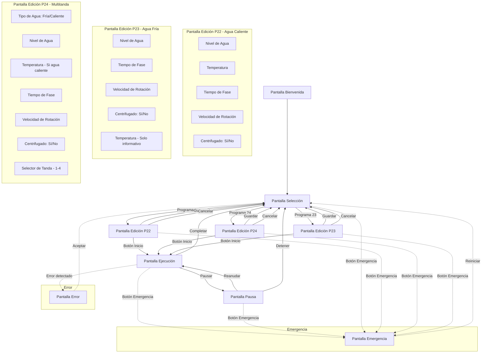

## Diagrama de Pantallas Nextion

```mermaid
flowchart TB
    A[Pantalla Bienvenida] --> B[Pantalla Selección]
    
    B -->|Programa 22| C1[Pantalla Edición P22]
    B -->|Programa 23| C3[Pantalla Edición P23]
    B -->|Programa 24| C2[Pantalla Edición P24]
    
    C1 -->|Botón Inicio| D[Pantalla Ejecución]
    C2 -->|Botón Inicio| D
    C3 -->|Botón Inicio| D
    
    C1 -->|Guardar| B
    C1 -->|Cancelar| B
    C2 -->|Guardar| B
    C2 -->|Cancelar| B
    C3 -->|Guardar| B
    C3 -->|Cancelar| B
    
    D -->|Pausar| E[Pantalla Pausa]
    D -->|Completar| B  
    
    E -->|Reanudar| D
    E -->|Detener| B
    
    subgraph "Pantalla Edición P22 - Agua Caliente"
        C1_1[Nivel de Agua]
        C1_2[Temperatura]
        C1_3[Tiempo de Fase]
        C1_4[Velocidad de Rotación]
        C1_5[Centrifugado: Sí/No]
    end
    
    subgraph "Pantalla Edición P23 - Agua Fría"
        C3_1[Nivel de Agua]
        C3_2[Tiempo de Fase]
        C3_3[Velocidad de Rotación]
        C3_4[Centrifugado: Sí/No]
        C3_5[Temperatura - Solo informativo]
    end
    
    subgraph "Pantalla Edición P24 - Multitanda"
        C2_1[Tipo de Agua: Fría/Caliente]
        C2_2[Nivel de Agua]
        C2_3[Temperatura - Si agua caliente]
        C2_4[Tiempo de Fase]
        C2_5[Velocidad de Rotación]
        C2_6[Centrifugado: Sí/No]
        C2_7[Selector de Tanda - 1-4]
    end
    
    subgraph "Emergencia"
        F[Pantalla Emergencia]
    end
    
    D -.->|Botón Emergencia| F
    E -.->|Botón Emergencia| F
    B -.->|Botón Emergencia| F
    C1 -.->|Botón Emergencia| F
    C2 -.->|Botón Emergencia| F
    C3 -.->|Botón Emergencia| F
    
    F -.->|Reiniciar| B
    
    subgraph "Error"
        G[Pantalla Error]
    end
    
    D -.->|Error detectado| G
    G -.->|Aceptar| B
```