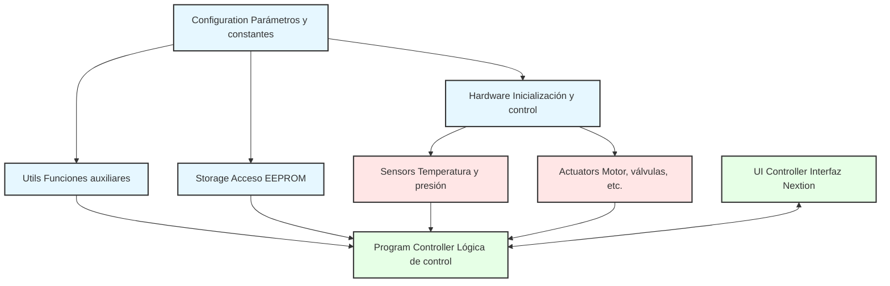

# Estructura Modular Actualizada del Controlador de Lavadora Industrial

## Introducción

Esta propuesta presenta una estructura modular actualizada para el controlador de lavadora industrial, desarrollada en Arequipa, Perú. El sistema está adaptado para funcionar con el controlador ESP32-WROOM y pantalla táctil Nextion, reemplazando la implementación original basada en Arduino y LCD. La modularización permite un mejor mantenimiento, mayor facilidad para implementar nuevas características y una estructura más clara. El controlador está diseñado para gestionar tres programas específicos de lavado (22: Agua Caliente, 23: Agua Fría, y 24: Multitanda) mediante una máquina de estados robusta. Se desarrolla utilizando el IDE de Arduino versión 2.3.6 con el core ESP32 versión 3.2.0.

## Analogía: Sistema Modular de Orquesta Modernizado

Podemos visualizar el controlador como una orquesta donde cada sección de instrumentos (módulos) tiene su propia partitura (código) pero todos siguen la batuta del director (programa principal). Con la actualización del hardware, es como si la orquesta hubiera adoptado instrumentos electrónicos modernos y un sistema de dirección digital, manteniendo la misma armonía musical pero con capacidades tecnológicas ampliadas.

La máquina de estados representa el orden de la composición musical: cada estado (inicio, selección, ejecución, etc.) corresponde a un movimiento específico de la pieza, y las transiciones entre ellos siguen reglas musicales bien definidas. Los tres programas son como diferentes composiciones para la misma orquesta, cada una con su propio estilo y complejidad pero interpretadas por los mismos instrumentistas.

## Estructura de Archivos Propuesta

La nueva estructura mantiene la organización modular pero adapta los módulos para el nuevo hardware:

```
washerController/
│
├── mainController.ino        # Archivo principal (incluye setup, loop)
├── config.h                  # Configuraciones, constantes y definiciones globales
├── hardware.cpp              # Gestión del hardware físico (ESP32, Nextion, botón de emergencia)
├── hardware.h
├── ui_controller.cpp         # Controlador de interfaz de usuario para Nextion
├── ui_controller.h
├── program_controller.cpp    # Controlador de programas de lavado y máquina de estados
├── program_controller.h
├── sensors.cpp               # Gestión de sensores (temperatura, presión)
├── sensors.h
├── actuators.cpp             # Control de actuadores (motor, válvulas)
├── actuators.h
├── storage.cpp               # Gestión de almacenamiento (ESP32 Preferences)
├── storage.h
└── utils.cpp                 # Utilidades generales y temporizadores asíncronos
└── utils.h
```

## Máquina de Estados del Sistema

El sistema implementa una máquina de estados completa que gestiona el flujo de operación:

```
┌────────────┐      ┌────────────┐      ┌───────────┐      ┌────────────┐
│   INICIO   │─────▶│  SELECCIÓN │─────▶│  ESPERA   │─────▶│  EJECUCIÓN │
└────────────┘      └────────────┘      └───────────┘      └─────┬──────┘
                          ▲                                       │
                          │                                       │
                          │                                       ▼
                    ┌─────┴──────┐      ┌───────────┐      ┌───────────┐
                    │FINALIZACIÓN│◀─────┤   PAUSA   │◀─────┤   ERROR   │
                    └────────────┘      └───────────┘      └───────────┘
                          ▲
                          │
                    ┌─────┴──────┐
                    │ EMERGENCIA │
                    └────────────┘
```

## Programas de Lavado Específicos

El sistema implementa tres programas específicos:

1. **Programa 22**: Lavado con agua caliente con gestión activa de temperatura
   - Utiliza exclusivamente agua caliente
   - Implementa control activo de temperatura (±2°C del objetivo)
   - Fases: Llenado → Lavado → Drenaje → Centrifugado (opcional)

2. **Programa 23**: Lavado con agua fría sin gestión de temperatura
   - Utiliza exclusivamente agua fría
   - No controla temperatura (sensor solo informativo)
   - Fases: Llenado → Lavado → Drenaje → Centrifugado (opcional)

3. **Programa 24**: Lavado configurable con múltiples tandas
   - Tipo de agua configurable (caliente o fría)
   - Ejecuta 4 tandas consecutivas (cada una con 3 fases)
   - Si usa agua caliente, implementa control activo de temperatura
   - Fases: 4x(Llenado → Lavado → Drenaje) → Centrifugado (opcional)

## Principales Cambios en los Módulos

### 1. Módulo de Configuración (config.h)

**Cambios:**
- Definiciones específicas para los tres programas de lavado
- Constantes para gestión de temperatura en agua caliente
- Adición de configuraciones para la comunicación serial con Nextion
- Definición de componentes y páginas de la pantalla Nextion
- Adaptación de configuraciones para ESP32
- Constantes para máquina de estados (7 estados principales)

### 2. Módulo de Hardware (hardware.h / hardware.cpp)

**Cambios:**
- Reemplazo del controlador LCD por interfaz serial para Nextion
- Implementación de métodos de comunicación bidireccional con Nextion
- Manejo del botón de emergencia con antirrebote (prioridad máxima)
- Diferenciación entre válvulas de agua fría y caliente
- Implementación de control separado para válvula de vapor

### 3. Módulo de UI Controller (ui_controller.h / ui_controller.cpp)

**Cambios:**
- Interfaz completa para los tres programas específicos
- Pantallas especializadas para configuración de agua caliente/fría
- Pantalla dedicada para programa multitanda (configuración de tandas)
- Implementación de visualización de temperatura y presión en tiempo real
- Pantallas para estados de emergencia y error con información detallada

### 4. Módulo de Program Controller (program_controller.h / program_controller.cpp)

**Cambios:**
- Implementación de máquina de estados completa con 7 estados
- Lógica específica para los tres programas (22, 23, 24)
- Sistema de gestión de temperatura para programas con agua caliente
- Manejo de emergencia con detención segura de todos los sistemas
- Gestión especializada para programa multitanda (4 tandas secuenciales)
- Sistema de callbacks para operaciones temporizadas no bloqueantes

### 5. Módulo de Sensores (sensors.h / sensors.cpp)

**Cambios:**
- Implementación de monitoreo continuo y asincrónico de temperatura
- Mejora en la precisión para detección de niveles de agua
- Funciones específicas para verificar umbrales de temperatura (±2°C)
- Algoritmos de estabilización para lecturas precisas

### 6. Módulo de Actuadores (actuators.h / actuators.cpp)

**Cambios:**
- Control diferenciado para válvulas de agua fría/caliente
- Implementación de rutinas de control de temperatura (drenaje parcial)
- Patrones configurables de rotación para diferentes intensidades
- Sistema de seguridad para centrifugado con verificaciones previas
- Gestión de emergencia con secuencia segura de apagado

### 7. Otros Módulos

- **Storage**: Implementa almacenamiento mediante ESP32 Preferences con estructuras para configuración de los tres programas
- **Utils**: Proporciona sistema completo de temporizadores asíncronos y callbacks para operaciones no bloqueantes

## Beneficios Adicionales de la Actualización

1. **Gestión Avanzada de Programas**: Implementación robusta de tres programas específicos con comportamientos diferenciados.
2. **Control Activo de Temperatura**: Algoritmos avanzados para mantener la temperatura en programas de agua caliente.
3. **Interfaz Mejorada**: Pantallas específicas para cada programa con retroalimentación visual en tiempo real.
4. **Sistema de Emergencia**: Detección inmediata con secuencia segura de detención en cualquier fase.
5. **Operación Asíncrona**: Implementación completa de temporizadores no bloqueantes para mantener responsividad del sistema.
6. **Escalabilidad**: Arquitectura que permite añadir nuevos programas o modificar los existentes sin cambios estructurales.

## Diagrama de Interacción de Módulos Actualizado



Los siguientes documentos detallan cada uno de los módulos propuestos con sus adaptaciones para el nuevo hardware y la implementación de los tres programas específicos.
