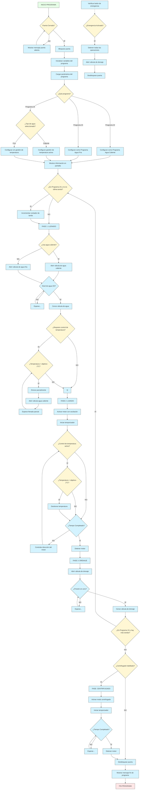

```mermaid
flowchart TD
    %% Configuración
    classDef proceso fill:#d4f3ff,stroke:#333,stroke-width:1
    classDef decision fill:#fff7d4,stroke:#333,stroke-width:1
    classDef inicio fill:#e6ffe6,stroke:#333,stroke-width:1
    classDef fin fill:#ffe6e6,stroke:#333,stroke-width:1
    
    %% Inicio del programa
    A[INICIO PROGRAMA] --> B{Puerta Cerrada?}
    class A inicio
    
    %% Verificaciones iniciales
    B -->|NO| C[Mostrar mensaje puerta abierta]
    B -->|SÍ| D[Bloquear puerta]
    class B decision
    
    C --> B
    D --> E[Inicializar variables del programa]
    
    %% Setup del programa
    E --> F[Cargar parámetros del programa]
    F --> ProgramCheck{¿Qué programa?}
    class ProgramCheck decision
    
    %% Selección del programa
    ProgramCheck -->|Programa 22| Prog22[Configurar como Programa Agua Caliente]
    ProgramCheck -->|Programa 23| Prog23[Configurar como Programa Agua Fría]
    ProgramCheck -->|Programa 24| Prog24Config{¿Tipo de agua seleccionado?}
    class Prog24Config decision
    
    Prog24Config -->|Caliente| Prog24Hot[Configurar gestión de temperatura activa]
    Prog24Config -->|Fría| Prog24Cold[Configurar sin gestión de temperatura]
    
    Prog22 --> G[Mostrar información en pantalla]
    Prog23 --> G
    Prog24Hot --> G
    Prog24Cold --> G
    
    %% Inicio del ciclo de lavado
    G --> TandaCheck{¿Es Programa 24 y no es última tanda?}
    class TandaCheck decision
    
    TandaCheck -->|SÍ| TandaCounter[Incrementar contador de tanda]
    TandaCheck -->|NO| H
    TandaCounter --> H
    
    %% Primera fase - Llenado
    H[FASE 1: LLENADO] --> WaterType{¿Usa agua caliente?}
    class WaterType decision
    
    WaterType -->|SÍ| I1[Abrir válvula de agua caliente]
    WaterType -->|NO| I2[Abrir válvula de agua fría]
    
    I1 --> J{Nivel de agua OK?}
    I2 --> J
    class J decision
    
    J -->|NO| K[Esperar...]
    K --> J
    J -->|SÍ| L1[Cerrar válvula de agua]
    
    %% Control de temperatura solo programas con agua caliente
    L1 --> TempControl{¿Requiere control de temperatura?}
    class TempControl decision
    
    TempControl -->|SÍ| TempCheck{¿Temperatura < objetivo-2°C?}
    TempControl -->|NO| Q
    class TempCheck decision
    
    TempCheck -->|SÍ| TempAction1[Drenar parcialmente]
    TempCheck -->|NO| Q
    
    TempAction1 --> TempAction2[Abrir válvula agua caliente]
    TempAction2 --> TempAction3[Esperar llenado parcial]
    TempAction3 --> TempCheck
    
    %% Tercera fase - Lavado
    Q --> R[FASE 2: LAVADO]
    R --> S[Activar motor con oscilación]
    S --> T[Iniciar temporizador]
    
    %% Loop de lavado con control de temperatura cuando es necesario
    T --> WashTempControl{¿Control de temperatura activo?}
    class WashTempControl decision
    
    WashTempControl -->|SÍ| WashTempCheck{¿Temperatura < objetivo-2°C?}
    WashTempControl -->|NO| U
    class WashTempCheck decision
    
    WashTempCheck -->|SÍ| WashTempAction[Gestionar temperatura]
    WashTempCheck -->|NO| U
    
    WashTempAction --> U
    
    U{¿Tiempo Completado?}
    class U decision
    
    U -->|NO| V[Controlar dirección del motor]
    V --> WashTempControl
    U -->|SÍ| W[Detener motor]
    
    %% Cuarta fase - Drenaje
    W --> X[FASE 3: DRENAJE]
    X --> Y[Abrir válvula de drenaje]
    Y --> Z{¿Presión en cero?}
    class Z decision
    
    Z -->|NO| AA[Esperar...]
    AA --> Z
    Z -->|SÍ| AB[Cerrar válvula de drenaje]
    
    %% Verificación de programa 24 para ciclo de tandas
    AB --> MultipleCycles{¿Es Programa 24 y hay más tandas?}
    class MultipleCycles decision
    
    MultipleCycles -->|SÍ| TandaCheck
    MultipleCycles -->|NO| CentrifugeCheck
    
    %% Verificación de centrifugado
    CentrifugeCheck{¿Centrifugado habilitado?}
    class CentrifugeCheck decision
    
    CentrifugeCheck -->|SÍ| AC[FASE: CENTRIFUGADO]
    CentrifugeCheck -->|NO| AI
    
    %% Fase de centrifugado
    AC --> AD[Activar modo centrifugado]
    AD --> AE[Iniciar temporizador]
    AE --> AF{¿Tiempo Completado?}
    class AF decision
    
    AF -->|NO| AG[Esperar...]
    AG --> AF
    AF -->|SÍ| AH[Detener motor]
    AH --> AI
    
    %% Finalización
    AI[Desbloquear puerta]
    AI --> AJ[Mostrar mensaje fin de programa]
    AJ --> AK[FIN PROGRAMA]
    class AK fin
    
    %% Procesos de verificación constante en paralelo
    B1[Verificar botón de emergencia] -.-> B2{¿Emergencia Activada?}
    class B2 decision
    
    B2 -->|SÍ| B3[Detener todas las operaciones]
    B3 --> B4[Abrir válvula de drenaje]
    B4 --> B5[Desbloquear puerta]
    
    %% Aplicar estilos
    class H,I1,I2,J,K,L1,Q,R,S,T,U,V,W,X,Y,Z,AA,AB,AC,AD,AE,AF,AG,AH,AI,AJ proceso
    class TempAction1,TempAction2,TempAction3,WashTempAction proceso
    class Prog22,Prog23,Prog24Hot,Prog24Cold,TandaCounter proceso
    class C,D,E,F,G proceso
    class B1,B3,B4,B5 proceso
```