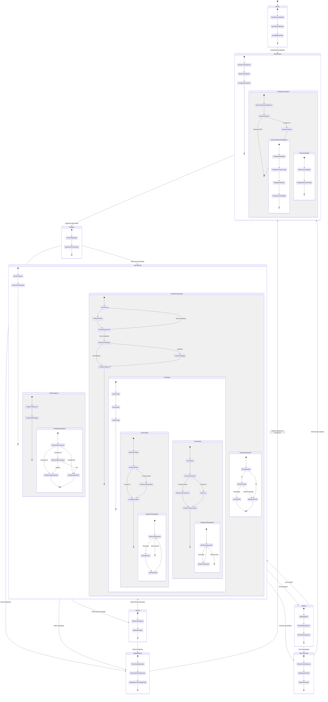

```mermaid
stateDiagram-v2
    %% Configuración de estilos
    state "INICIO" as inicio {
        [*] --> InicializacionHardware
        InicializacionHardware --> InicializacionModulos
        InicializacionModulos --> PantallaBienvenida
        PantallaBienvenida --> [*]
    }
    
    state "SELECCIÓN" as seleccion {
        [*] --> MostrarListaPrograma
        MostrarListaPrograma --> SeleccionPrograma
        SeleccionPrograma --> ConfiguracionParams
        
        state "ConfiguracionParams" as config {
            [*] --> SeleccionParametrosBasicos
            
            state "SeleccionParametrosBasicos" as paramBasic {
                [*] --> ConfigurarNivelAgua
                ConfigurarNivelAgua --> ConfigurarTiempoLavado
                ConfigurarTiempoLavado --> ConfigurarRotacion
                ConfigurarRotacion --> ConfigurarCentrifugado
                ConfigurarCentrifugado --> [*]
            }
            
            SeleccionParametrosBasicos --> VerificarPrograma
            
            VerificarPrograma --> OpcionesAgua24: Programa 24
            VerificarPrograma --> [*]: Programa 22/23
            
            state "OpcionesAgua24" as aguaOpt {
                [*] --> SeleccionarTipoAgua
                SeleccionarTipoAgua --> ConfigurarNumeroTandas
                ConfigurarNumeroTandas --> [*]
            }
            
            OpcionesAgua24 --> [*]
        }
        
        ConfiguracionParams --> [*]
    }
    
    state "ESPERA" as espera {
        [*] --> VerificarSeguridad
        VerificarSeguridad --> EsperandoConfirmacion
        EsperandoConfirmacion --> [*]
    }
    
    state "EJECUCIÓN" as ejecucion {
        [*] --> IniciarPrograma
        
        state "IniciarPrograma" as iniciarProg {
            [*] --> CargarConfiguracion
            CargarConfiguracion --> ConfigurarModoAgua
            
            state "ConfigurarModoAgua" as modoAgua {
                [*] --> VerificarTipoPrograma
                VerificarTipoPrograma --> ConfigurarAguaCaliente: Programa 22
                VerificarTipoPrograma --> ConfigurarAguaFria: Programa 23
                VerificarTipoPrograma --> VerificarSeleccionAgua: Programa 24
                
                VerificarSeleccionAgua --> ConfigurarAguaCaliente: Caliente
                VerificarSeleccionAgua --> ConfigurarAguaFria: Fría
                
                ConfigurarAguaCaliente --> [*]
                ConfigurarAguaFria --> [*]
            }
            
            ConfigurarModoAgua --> [*]
        }
        
        IniciarPrograma --> ControlarCicloLavado
        
        state "ControlarCicloLavado" as cicloLavado {
            [*] --> IniciarFase
            
            state "IniciarFase" as fase {
                [*] --> FaseLlenado
                
                state "FaseLlenado" as llenado {
                    [*] --> AbrirValvulaAgua
                    AbrirValvulaAgua --> MonitorearNivel
                    MonitorearNivel --> GestionarTemperatura: Si agua caliente
                    MonitorearNivel --> CompletarLlenado: Si agua fría
                    
                    state "GestionarTemperatura" as gestTemp {
                        [*] --> VerificarTemperatura
                        VerificarTemperatura --> DrenajeParcial: Temp baja
                        VerificarTemperatura --> [*]: Temp correcta
                        
                        DrenajeParcial --> NuevoLlenado
                        NuevoLlenado --> VerificarTemperatura
                    }
                    
                    GestionarTemperatura --> CompletarLlenado
                    CompletarLlenado --> [*]
                }
                
                FaseLlenado --> FaseLavado
                
                state "FaseLavado" as lavado {
                    [*] --> ActivarMotor
                    ActivarMotor --> IniciarTemporizador
                    IniciarTemporizador --> MonitorearTemperatura: Si agua caliente
                    IniciarTemporizador --> SoloLavar: Si agua fría
                    
                    state "MonitorearTemperatura" as monTemp {
                        [*] --> VerificarTempLavado
                        VerificarTempLavado --> AjustarTemperatura: Temp baja
                        VerificarTempLavado --> [*]: Temp correcta
                        
                        AjustarTemperatura --> VerificarTempLavado
                    }
                    
                    MonitorearTemperatura --> FinalizarTiempoLavado
                    SoloLavar --> FinalizarTiempoLavado
                    FinalizarTiempoLavado --> [*]
                }
                
                FaseLavado --> FaseDrenaje
                FaseDrenaje --> [*]
            }
            
            IniciarFase --> VerificarFinFase
            VerificarFinFase --> VerificarPrograma24
            
            state "VerificarPrograma24" as verProg24 {
                [*] --> EsPrograma24
                EsPrograma24 --> VerificarTandas: Sí
                EsPrograma24 --> SiguienteAccion: No
                
                VerificarTandas --> NuevaTanda: Más tandas
                VerificarTandas --> SiguienteAccion: Tandas completas
                
                NuevaTanda --> [*]
                SiguienteAccion --> [*]
            }
            
            VerificarPrograma24 --> IniciarFase: Nueva tanda/fase
            VerificarPrograma24 --> VerificarCentrifugado: Ciclo completado
            
            VerificarCentrifugado --> FaseCentrifugado: Habilitado
            VerificarCentrifugado --> FinalizarPrograma: Deshabilitado
            
            FaseCentrifugado --> FinalizarPrograma
            FinalizarPrograma --> [*]
        }
        
        ControlarCicloLavado --> [*]
    }
    
    state "PAUSA" as pausa {
        [*] --> DetenerActuadores
        DetenerActuadores --> MantenerEstado
        MantenerEstado --> [*]
    }
    
    state "FINALIZACIÓN" as finalizacion {
        [*] --> DetenerTodosSistemas
        DetenerTodosSistemas --> DesbloquearPuerta
        DesbloquearPuerta --> MostrarResumen
        MostrarResumen --> [*]
    }
    
    state "ERROR" as error {
        [*] --> IdentificarError
        IdentificarError --> MostrarMensajeError
        MostrarMensajeError --> IntentarRecuperacion
        IntentarRecuperacion --> [*]
    }
    
    state "EMERGENCIA" as emergencia {
        [*] --> PararInmediatamente
        PararInmediatamente --> DesactivarTodosSistemas
        DesactivarTodosSistemas --> DesbloquearPuertaSeguridad
        DesbloquearPuertaSeguridad --> [*]
    }
    
    %% Transiciones entre estados principales
    [*] --> inicio
    inicio --> seleccion: Inicialización completada
    seleccion --> espera: Programa seleccionado
    espera --> ejecucion: Botón inicio presionado
    ejecucion --> pausa: Botón pausa presionado
    pausa --> ejecucion: Botón reinicio presionado
    ejecucion --> finalizacion: Programa completado
    finalizacion --> seleccion: Botón nuevo programa
    
    %% Transiciones de error
    ejecucion --> error: Error detectado
    error --> ejecucion: Error resuelto
    error --> finalizacion: Error irrecuperable
    
    %% Transiciones de emergencia
    espera --> emergencia: Botón emergencia
    ejecucion --> emergencia: Botón emergencia
    pausa --> emergencia: Botón emergencia
    emergencia --> seleccion: Reinicio después de emergencia
```