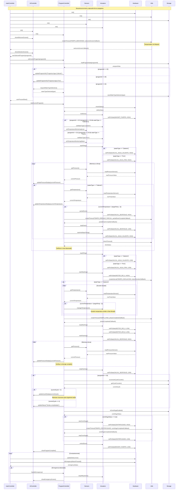

```mermaid
sequenceDiagram
    participant Main as mainController
    participant UI as UIController
    participant Program as ProgramController
    participant Sensors as Sensors
    participant Actuators as Actuators
    participant HW as Hardware
    participant Utils as Utils
    participant Storage as Storage
    
    Note over Main,Storage: Secuencia de inicio y ejecución de un programa
    
    %% Inicialización del sistema
    Main->>HW: init()
    Main->>Utils: init()
    Main->>Storage: init()
    Main->>Sensors: init()
    Main->>Actuators: init()
    Main->>UI: init()
    Main->>Program: init()
    
    %% Mostrar bienvenida
    Main->>UI: showWelcomeScreen()
    Main->>Utils: createTimeout(TIEMPO_BIENVENIDA, welcomeScreenCallback)
    Note over Utils: Temporizador sin bloqueo
    
    %% Tiempo de bienvenida transcurrido
    Utils-->>Main: welcomeScreenCallback()
    Main->>UI: showSelectionScreen()
    
    %% Interacción del usuario - Selección de programa
    UI-->>Main: userSelectedProgram(programId)
    Main->>Program: setCurrentProgram(programId)
    Main->>Storage: loadProgramData(programId)
    Storage-->>Program: programData
    
    %% Configuración específica según programa
    alt programId == 22
        Program->>UI: updateProgramInfo("Programa Agua Caliente")
    else programId == 23
        Program->>UI: updateProgramInfo("Programa Agua Fría")
    else programId == 24
        Program->>UI: requestWaterTypeSelection()
        UI-->>Program: waterTypeSelected(type)
        Program->>Storage: saveWaterTypeSelection(type)
    end
    
    %% Usuario inicia programa
    UI-->>Main: userPressedStart()
    Main->>Program: startCurrentProgram()
    
    %% Verificación de seguridad
    Program->>HW: checkSafety()
    HW-->>Program: safetyStatus
    
    %% Bloqueo de puerta
    Program->>Actuators: lockDoor()
    Actuators->>HW: setPinState(MAGNET_PUERTA, HIGH)
    
    %% Inicialización específica según programa
    alt programId == 22 || (programId == 24 && waterType == "Caliente")
        Program->>Actuators: setWaterType("Caliente")
        Program->>Sensors: setTemperatureMonitoring(true)
    else programId == 23 || (programId == 24 && waterType == "Fría")
        Program->>Actuators: setWaterType("Fría")
        Program->>Sensors: setTemperatureMonitoring(false)
    end
    
    %% Ejecución de fase (llenado)
    Program->>Actuators: startFilling()
    
    alt waterType == "Caliente"
        Actuators->>HW: setPinState(VALVUL_AGUA_CALIENTE, HIGH)
    else waterType == "Fría"
        Actuators->>HW: setPinState(VALVUL_AGUA_FRIA, HIGH)
    end
    
    %% Monitoreo continuo de llenado
    loop Mientras se llena
        Program->>Sensors: getPressure()
        Sensors->>HW: readPressureSensor()
        HW-->>Sensors: rawPressureValue
        Sensors-->>Program: currentPressure
        
        Program->>UI: updatePressureDisplay(currentPressure)
        
        alt waterType == "Caliente"
            Program->>Sensors: getTemperature()
            Sensors->>HW: readTemperatureSensor()
            HW-->>Sensors: rawTempValue
            Sensors-->>Program: currentTemperature
            Program->>UI: updateTemperatureDisplay(currentTemperature)
            
            alt currentTemperature < (targetTemp - 2)
                Program->>Actuators: partialDrain()
                Actuators->>HW: setPinState(VALVUL_DESFOGUE, HIGH)
                Program->>Utils: createTimeout(TIEMPO_DRENAJE_PARCIAL, partialDrainCompleteCallback)
                Utils-->>Program: partialDrainCompleteCallback()
                Program->>Actuators: stopDrain()
                Actuators->>HW: setPinState(VALVUL_DESFOGUE, LOW)
                Program->>Actuators: startHotWaterFilling()
                Actuators->>HW: setPinState(VALVUL_AGUA_CALIENTE, HIGH)
            end
        end
        
        Program->>Utils: checkTimeout()
        Utils-->>Program: timeStatus
        
        Note over Program: Verificar si nivel alcanzado
    end
    
    %% Nivel alcanzado - cerrar válvula
    Program->>Actuators: stopFilling()
    
    alt waterType == "Caliente"
        Actuators->>HW: setPinState(VALVUL_AGUA_CALIENTE, LOW)
    else waterType == "Fría"
        Actuators->>HW: setPinState(VALVUL_AGUA_FRIA, LOW)
    end
    
    %% Inicio fase lavado
    Program->>Actuators: startWashing()
    Actuators->>HW: setPinState(MOTOR_DIR_A, HIGH)
    Actuators->>Utils: createInterval(TIEMPO_OSCILACION, motorDirectionCallback)
    
    %% Control de temperatura durante lavado (solo en programas con agua caliente)
    alt waterType == "Caliente"
        loop Durante lavado
            Program->>Sensors: getTemperature()
            Sensors->>HW: readTemperatureSensor()
            HW-->>Sensors: rawTempValue
            Sensors-->>Program: currentTemperature
            
            alt currentTemperature < (targetTemp - 2)
                Program->>Actuators: manageTemperature()
                Note over Actuators: Gestión temperatura similar a fase llenado
            end
        end
    end
    
    %% Control de tiempo para fin de fase
    Program->>Utils: createTimeout(TIEMPO_FASE, phaseCompletedCallback)
    
    %% Fase completa
    Utils-->>Program: phaseCompletedCallback()
    Program->>Actuators: stopWashing()
    Actuators->>HW: setPinState(MOTOR_DIR_A, LOW)
    Actuators->>HW: setPinState(MOTOR_DIR_B, LOW)
    
    %% Fase de drenaje
    Program->>Actuators: startDraining()
    Actuators->>HW: setPinState(VALVUL_DESFOGUE, HIGH)
    
    %% Monitoreo de drenaje
    loop Mientras drena
        Program->>Sensors: getPressure()
        Sensors->>HW: readPressureSensor()
        HW-->>Sensors: rawPressureValue
        Sensors-->>Program: currentPressure
        
        Program->>UI: updatePressureDisplay(currentPressure)
        
        Note over Program: Verificar si drenaje completo
    end
    
    %% Drenaje completo
    Program->>Actuators: stopDraining()
    Actuators->>HW: setPinState(VALVUL_DESFOGUE, LOW)
    
    %% Verificación de programa 24 para múltiples tandas
    alt programId == 24
        Program->>Storage: incrementCycleCounter()
        Program->>Storage: getCycleCounter()
        Storage-->>Program: currentCycle
        
        alt currentCycle < 4
            Program->>UI: updateCycleDisplay(currentCycle)
            Note over Program: Reiniciar el proceso para siguiente tanda
        else currentCycle >= 4
            Program->>UI: updateStatus("Tandas completadas")
        end
    end
    
    %% Verificación de centrifugado
    Program->>Storage: isCentrifugeEnabled()
    Storage-->>Program: centrifugeStatus
    
    alt centrifugeStatus == true
        Program->>Actuators: startCentrifuge()
        Actuators->>HW: setPinState(CENTRIFUGADO, HIGH)
        Program->>Utils: createTimeout(TIEMPO_CENTRIFUGADO, centrifugeCompletedCallback)
        Utils-->>Program: centrifugeCompletedCallback()
        Program->>Actuators: stopCentrifuge()
        Actuators->>HW: setPinState(CENTRIFUGADO, LOW)
    end
    
    %% Finalización del programa
    Program->>Actuators: unlockDoor()
    Actuators->>HW: setPinState(MAGNET_PUERTA, LOW)
    Program->>UI: showProgramComplete()
    
    %% Verificación de emergencia (evento paralelo)
    loop Constantemente
        Main->>HW: updateDebouncer()
        Main->>HW: isEmergencyButtonPressed()
        HW-->>Main: emergencyStatus
        
        alt Emergencia detectada
            Main->>Program: handleEmergency()
            Program->>Actuators: stopAllSystems()
            Program->>UI: showEmergencyScreen()
        end
    end
```