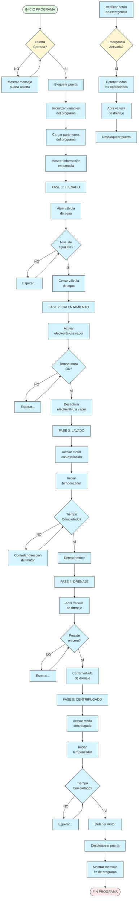

```mermaid
flowchart TD
    %% Configuración
    classDef proceso fill:#d4f3ff,stroke:#333,stroke-width:1
    classDef decision fill:#fff7d4,stroke:#333,stroke-width:1
    classDef inicio fill:#e6ffe6,stroke:#333,stroke-width:1
    classDef fin fill:#ffe6e6,stroke:#333,stroke-width:1
    
    %% Inicio del programa
    A([INICIO PROGRAMA]) --> B{Puerta\nCerrada?}
    class A inicio
    
    %% Verificaciones iniciales
    B -->|NO| C[Mostrar mensaje\npuerta abierta]
    B -->|SÍ| D[Bloquear puerta]
    class B decision
    
    C --> B
    D --> E[Inicializar variables\ndel programa]
    
    %% Setup del programa
    E --> F[Cargar parámetros\ndel programa]
    F --> G[Mostrar información\nen pantalla]
    
    %% Primera fase - Llenado
    G --> H[FASE 1: LLENADO]
    H --> I[Abrir válvula\nde agua]
    I --> J{Nivel de\nagua OK?}
    class J decision
    
    J -->|NO| K[Esperar...]
    K --> J
    J -->|SÍ| L[Cerrar válvula\nde agua]
    
    %% Segunda fase - Calentamiento
    L --> M[FASE 2: CALENTAMIENTO]
    M --> N[Activar\nelectroválvula vapor]
    N --> O{Temperatura\nOK?}
    class O decision
    
    O -->|NO| P[Esperar...]
    P --> O
    O -->|SÍ| Q[Desactivar\nelectroválvula vapor]
    
    %% Tercera fase - Lavado
    Q --> R[FASE 3: LAVADO]
    R --> S[Activar motor\ncon oscilación]
    S --> T[Iniciar\ntemporizador]
    T --> U{Tiempo\nCompletado?}
    class U decision
    
    U -->|NO| V[Controlar dirección\ndel motor]
    V --> U
    U -->|SÍ| W[Detener motor]
    
    %% Cuarta fase - Drenaje
    W --> X[FASE 4: DRENAJE]
    X --> Y[Abrir válvula\nde drenaje]
    Y --> Z{Presión\nen cero?}
    class Z decision
    
    Z -->|NO| AA[Esperar...]
    AA --> Z
    Z -->|SÍ| AB[Cerrar válvula\nde drenaje]
    
    %% Quinta fase - Centrifugado
    AB --> AC[FASE 5: CENTRIFUGADO]
    AC --> AD[Activar modo\ncentrifugado]
    AD --> AE[Iniciar\ntemporizador]
    AE --> AF{Tiempo\nCompletado?}
    class AF decision
    
    AF -->|NO| AG[Esperar...]
    AG --> AF
    AF -->|SÍ| AH[Detener motor]
    
    %% Finalización
    AH --> AI[Desbloquear puerta]
    AI --> AJ[Mostrar mensaje\nfin de programa]
    AJ --> AK([FIN PROGRAMA])
    class AK fin
    
    %% Procesos de verificación constante (en paralelo)
    B1[Verificar botón\nde emergencia] -.-> B2{Emergencia\nActivada?}
    class B2 decision
    
    B2 -->|SÍ| B3[Detener todas\nlas operaciones]
    B3 --> B4[Abrir válvula\nde drenaje]
    B4 --> B5[Desbloquear puerta]
    
    %% Aplicar estilos
    class H,I,J,K,L,M,N,O,P,Q,R,S,T,U,V,W,X,Y,Z,AA,AB,AC,AD,AE,AF,AG,AH,AI,AJ proceso
    class C,D,E,F,G proceso
    class B1,B3,B4,B5 proceso
```