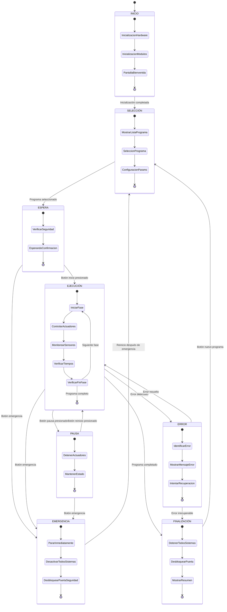

```mermaid
stateDiagram-v2
    %% Configuración de estilos
    state "INICIO" as inicio {
        [*] --> InicializacionHardware
        InicializacionHardware --> InicializacionModulos
        InicializacionModulos --> PantallaBienvenida
        PantallaBienvenida --> [*]
    }
    
    state "SELECCIÓN" as seleccion {
        [*] --> MostrarListaPrograma
        MostrarListaPrograma --> SeleccionPrograma
        SeleccionPrograma --> ConfiguracionParams
        ConfiguracionParams --> [*]
    }
    
    state "ESPERA" as espera {
        [*] --> VerificarSeguridad
        VerificarSeguridad --> EsperandoConfirmacion
        EsperandoConfirmacion --> [*]
    }
    
    state "EJECUCIÓN" as ejecucion {
        [*] --> IniciarFase
        IniciarFase --> ControlarActuadores
        ControlarActuadores --> MonitorearSensores
        MonitorearSensores --> VerificarTiempos
        VerificarTiempos --> VerificarFinFase
        VerificarFinFase --> IniciarFase: Siguiente fase
        VerificarFinFase --> [*]: Programa completo
    }
    
    state "PAUSA" as pausa {
        [*] --> DetenerActuadores
        DetenerActuadores --> MantenerEstado
        MantenerEstado --> [*]
    }
    
    state "FINALIZACIÓN" as finalizacion {
        [*] --> DetenerTodosSistemas
        DetenerTodosSistemas --> DesbloquearPuerta
        DesbloquearPuerta --> MostrarResumen
        MostrarResumen --> [*]
    }
    
    state "ERROR" as error {
        [*] --> IdentificarError
        IdentificarError --> MostrarMensajeError
        MostrarMensajeError --> IntentarRecuperacion
        IntentarRecuperacion --> [*]
    }
    
    state "EMERGENCIA" as emergencia {
        [*] --> PararInmediatamente
        PararInmediatamente --> DesactivarTodosSistemas
        DesactivarTodosSistemas --> DesbloquearPuertaSeguridad
        DesbloquearPuertaSeguridad --> [*]
    }
    
    %% Transiciones entre estados principales
    [*] --> inicio
    inicio --> seleccion: Inicialización completada
    seleccion --> espera: Programa seleccionado
    espera --> ejecucion: Botón inicio presionado
    ejecucion --> pausa: Botón pausa presionado
    pausa --> ejecucion: Botón reinicio presionado
    ejecucion --> finalizacion: Programa completado
    finalizacion --> seleccion: Botón nuevo programa
    
    %% Transiciones de error
    ejecucion --> error: Error detectado
    error --> ejecucion: Error resuelto
    error --> finalizacion: Error irrecuperable
    
    %% Transiciones de emergencia
    espera --> emergencia: Botón emergencia
    ejecucion --> emergencia: Botón emergencia
    pausa --> emergencia: Botón emergencia
    emergencia --> seleccion: Reinicio después de emergencia
```