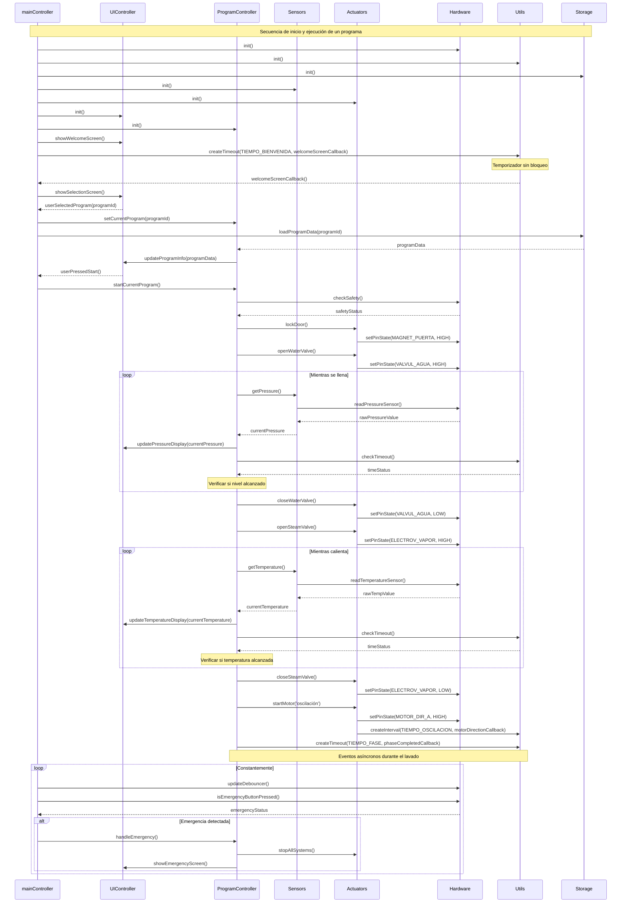

```mermaid
sequenceDiagram
    participant Main as mainController
    participant UI as UIController
    participant Program as ProgramController
    participant Sensors as Sensors
    participant Actuators as Actuators
    participant HW as Hardware
    participant Utils as Utils
    participant Storage as Storage
    
    Note over Main,Storage: Secuencia de inicio y ejecución de un programa
    
    %% Inicialización del sistema
    Main->>HW: init()
    Main->>Utils: init()
    Main->>Storage: init()
    Main->>Sensors: init()
    Main->>Actuators: init()
    Main->>UI: init()
    Main->>Program: init()
    
    %% Mostrar bienvenida
    Main->>UI: showWelcomeScreen()
    Main->>Utils: createTimeout(TIEMPO_BIENVENIDA, welcomeScreenCallback)
    Note over Utils: Temporizador sin bloqueo
    
    %% Tiempo de bienvenida transcurrido
    Utils-->>Main: welcomeScreenCallback()
    Main->>UI: showSelectionScreen()
    
    %% Interacción del usuario
    UI-->>Main: userSelectedProgram(programId)
    Main->>Program: setCurrentProgram(programId)
    Main->>Storage: loadProgramData(programId)
    Storage-->>Program: programData
    
    %% Configuración de programa
    Program->>UI: updateProgramInfo(programData)
    
    %% Usuario inicia programa
    UI-->>Main: userPressedStart()
    Main->>Program: startCurrentProgram()
    
    %% Verificación de seguridad
    Program->>HW: checkSafety()
    HW-->>Program: safetyStatus
    
    %% Bloqueo de puerta
    Program->>Actuators: lockDoor()
    Actuators->>HW: setPinState(MAGNET_PUERTA, HIGH)
    
    %% Ejecución de fase (llenado)
    Program->>Actuators: openWaterValve()
    Actuators->>HW: setPinState(VALVUL_AGUA, HIGH)
    
    %% Monitoreo continuo
    loop Mientras se llena
        Program->>Sensors: getPressure()
        Sensors->>HW: readPressureSensor()
        HW-->>Sensors: rawPressureValue
        Sensors-->>Program: currentPressure
        
        Program->>UI: updatePressureDisplay(currentPressure)
        
        Program->>Utils: checkTimeout()
        Utils-->>Program: timeStatus
        
        Note over Program: Verificar si nivel alcanzado
    end
    
    %% Nivel alcanzado - cerrar válvula
    Program->>Actuators: closeWaterValve()
    Actuators->>HW: setPinState(VALVUL_AGUA, LOW)
    
    %% Inicio calentamiento
    Program->>Actuators: openSteamValve()
    Actuators->>HW: setPinState(ELECTROV_VAPOR, HIGH)
    
    %% Monitoreo de temperatura
    loop Mientras calienta
        Program->>Sensors: getTemperature()
        Sensors->>HW: readTemperatureSensor()
        HW-->>Sensors: rawTempValue
        Sensors-->>Program: currentTemperature
        
        Program->>UI: updateTemperatureDisplay(currentTemperature)
        
        Program->>Utils: checkTimeout()
        Utils-->>Program: timeStatus
        
        Note over Program: Verificar si temperatura alcanzada
    end
    
    %% Temperatura alcanzada
    Program->>Actuators: closeSteamValve()
    Actuators->>HW: setPinState(ELECTROV_VAPOR, LOW)
    
    %% Inicio lavado (motor)
    Program->>Actuators: startMotor('oscilación')
    Actuators->>HW: setPinState(MOTOR_DIR_A, HIGH)
    Actuators->>Utils: createInterval(TIEMPO_OSCILACION, motorDirectionCallback)
    
    %% Control de tiempo para fin de fase
    Program->>Utils: createTimeout(TIEMPO_FASE, phaseCompletedCallback)
    
    Note over Utils,Program: Eventos asíncronos durante el lavado
    
    %% Verificación de emergencia (evento paralelo)
    loop Constantemente
        Main->>HW: updateDebouncer()
        Main->>HW: isEmergencyButtonPressed()
        HW-->>Main: emergencyStatus
        
        alt Emergencia detectada
            Main->>Program: handleEmergency()
            Program->>Actuators: stopAllSystems()
            Program->>UI: showEmergencyScreen()
        end
    end
```