# Diagramas de Flujo del Controlador de Lavadora Industrial

Este documento proporciona representaciones visuales del flujo de ejecución del controlador de lavadora industrial mediante diagramas. Estos diagramas complementan la documentación detallada y proporcionan una vista general de la estructura y funcionamiento del sistema.

## Diagrama de Módulos del Sistema

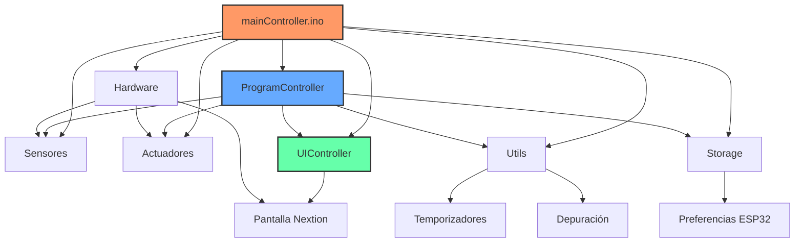

## Diagrama de Máquina de Estados

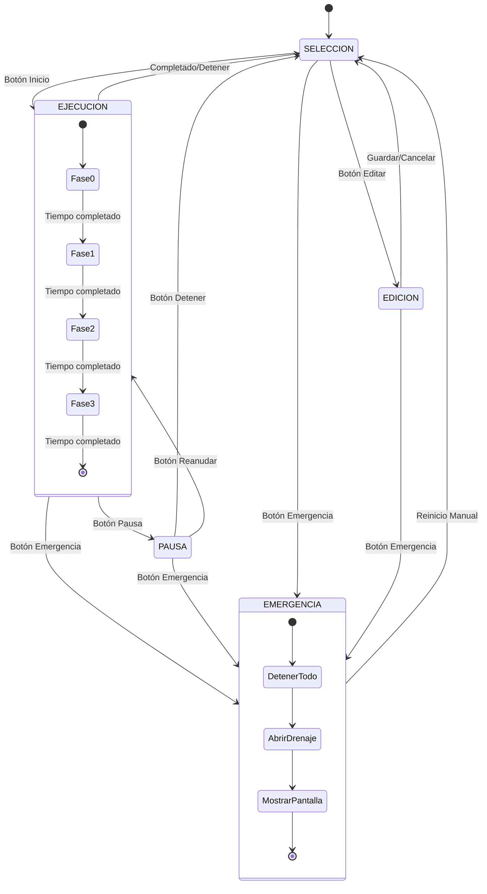

## Diagrama de Secuencia de Inicio de Programa

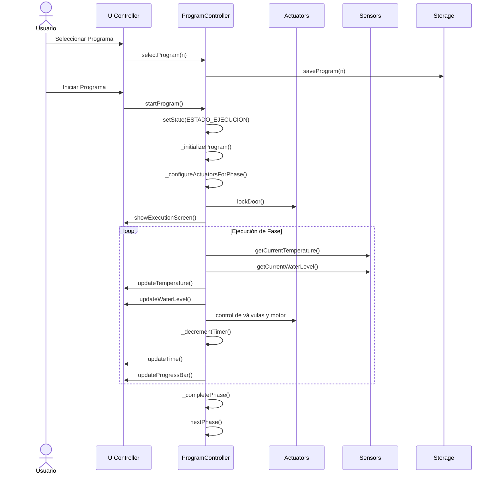

## Diagrama de Flujo de Ejecución de Fase

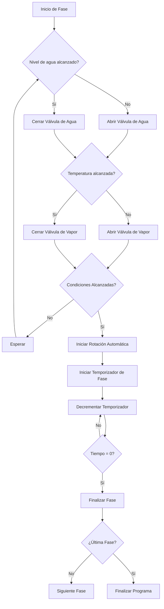

## Diagrama de Componentes de Hardware

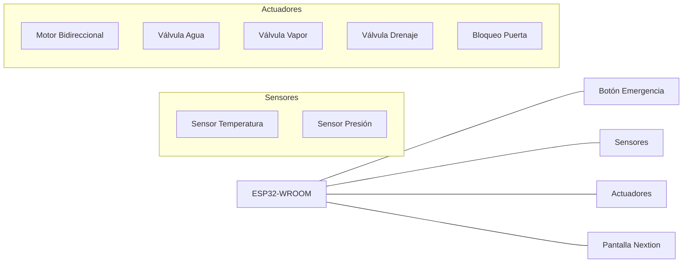

## Diagrama de Tiempos de Ejecución

```mermaid
gantt
    title Programa Normal (Estándar)
    dateFormat s
    axisFormat %M:%S
    
    section Fase 0: Prelavado
    Llenado de agua       :a1, 0, 60s
    Calentamiento         :a2, after a1, 120s
    Rotación y Lavado     :a3, after a2, 300s
    
    section Fase 1: Lavado Principal
    Llenado de agua       :b1, after a3, 60s
    Calentamiento         :b2, after b1, 180s
    Rotación y Lavado     :b3, after b2, 600s
    
    section Fase 2: Enjuague
    Drenaje               :c1, after b3, 60s
    Llenado de agua       :c2, after c1, 60s
    Rotación y Enjuague   :c3, after c2, 300s
    
    section Fase 3: Centrifugado
    Drenaje               :d1, after c3, 60s
    Centrifugado          :d2, after d1, 180s
```

## Diagrama de Secuencia para Manejo de Emergencia

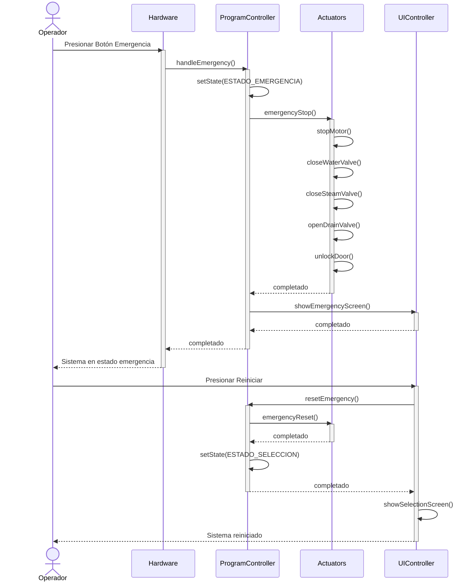

## Diagrama de Interacción de Módulos

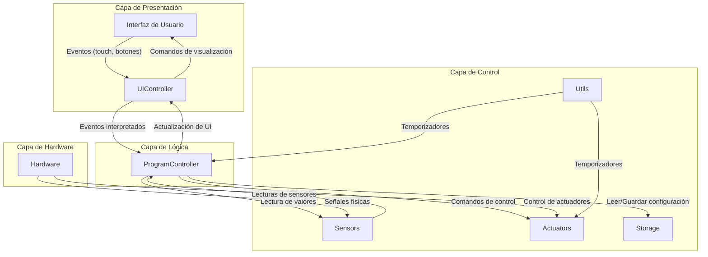

## Diagrama de Flujo de la Función Temporizadora

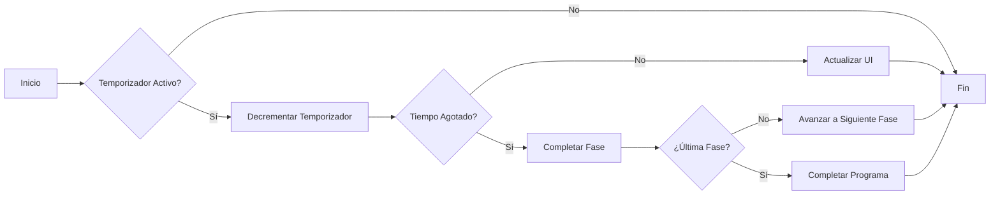

## Diagrama de Estructura de Datos

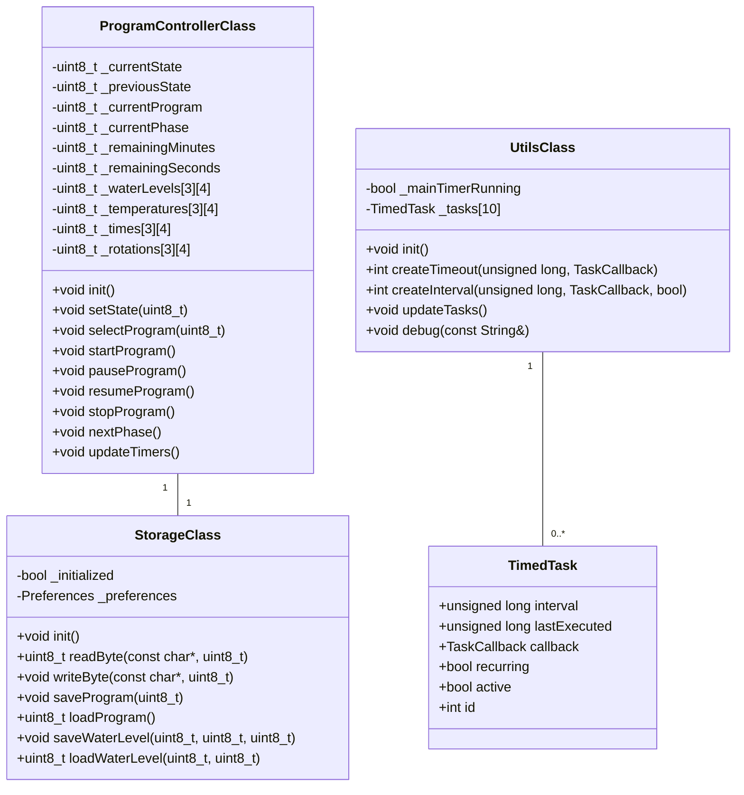

## Diagrama de Ciclo de Vida de una Operación de Lavado

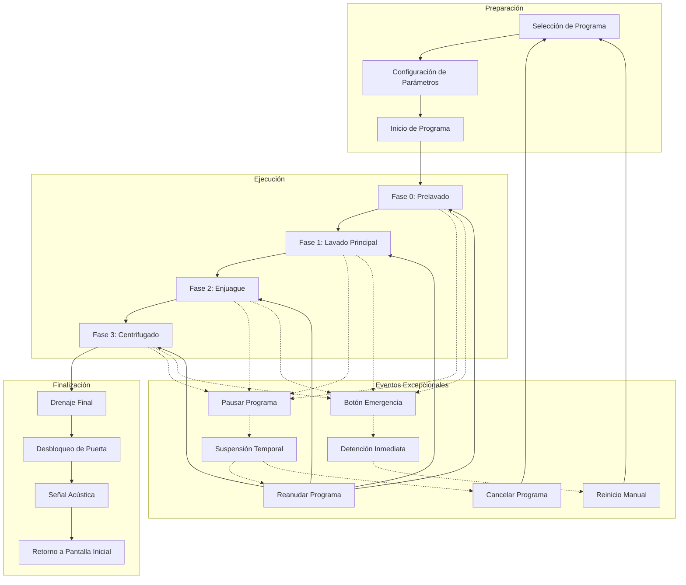

## Diagrama de Conexiones Físicas del ESP32

```mermaid
graph TD
    ESP[ESP32-WROOM] --- PIN15[Pin 15 - Botón Emergencia]
    ESP --- PIN12[Pin 12 - Motor Dir A]
    ESP --- PIN14[Pin 14 - Motor Dir B]
    ESP --- PIN27[Pin 27 - Centrifugado]
    ESP --- PIN26[Pin 26 - Válvula Agua]
    ESP --- PIN33[Pin 33 - Electroválvula Vapor]
    ESP --- PIN13[Pin 13 - Válvula Desfogue]
    ESP --- PIN25[Pin 25 - Bloqueo Electromagnético]
    
    ESP --- PINS5[Pin 5 - Sensor Presión DOUT]
    ESP --- PINS4[Pin 4 - Sensor Presión SCLK]
    ESP --- PIN23[Pin 23 - Sensor Temperatura OneWire]
    
    ESP --- SERIALTX[Serial2 TX - Nextion RX]
    ESP --- SERIALRX[Serial2 RX - Nextion TX]
    
    subgraph "Control de Motor"
        PIN12
        PIN14
        PIN27
    end
    
    subgraph "Válvulas"
        PIN26
        PIN33
        PIN13
    end
    
    subgraph "Seguridad"
        PIN15
        PIN25
    end
    
    subgraph "Sensores"
        PINS5
        PINS4
        PIN23
    end
    
    subgraph "Interfaz"
        SERIALTX
        SERIALRX
    end
```

## Diagrama de Pantallas Nextion

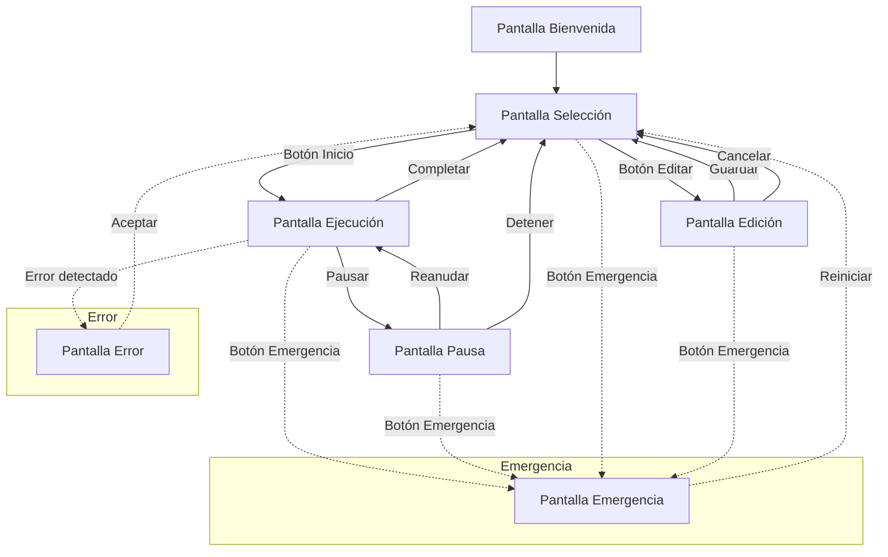

Esta documentación visual ofrece una perspectiva integral de la estructura, interacción y flujo de ejecución del sistema de control de la lavadora industrial. Los diagramas facilitan la comprensión del diseño modular implementado y sirven como referencia para el mantenimiento y futuras ampliaciones del sistema.
